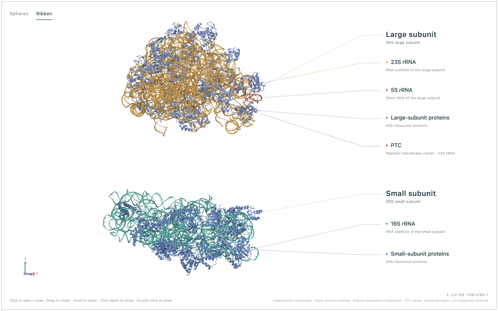
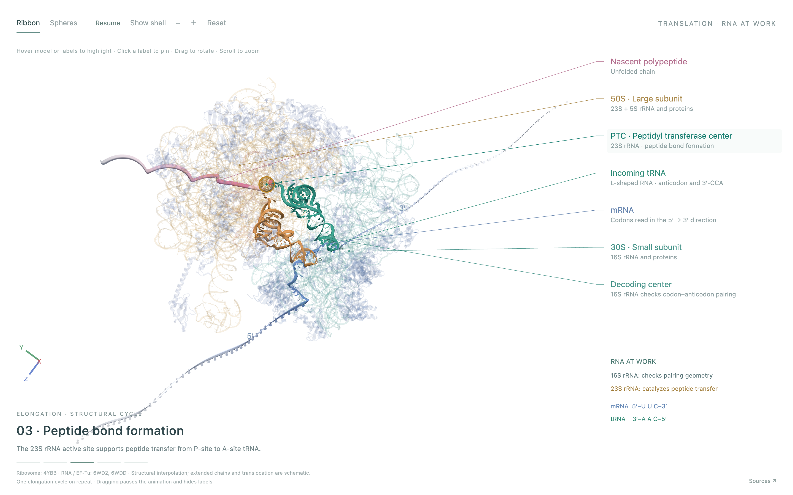
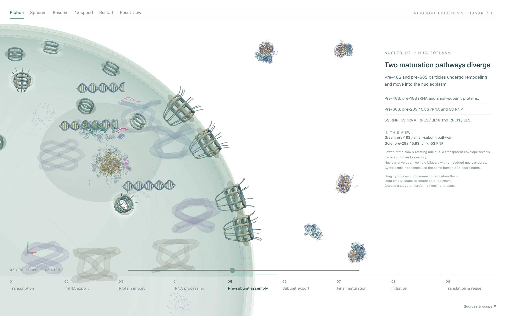

# Ribosome Explorer

Three English-language, interactive 3D teaching animations exploring ribosome structure, translation and biogenesis. Includes ribbon and sphere representations, rotation and zoom, and embedded structural data. No server, build dependencies or network connection is required to view the downloaded pages.

## Open the project

Download this repository, then open **docs/index.html** in a modern browser with WebGL enabled.

| Animation | File | Features |
| --- | --- | --- |
| Structure explorer | [structure.html](docs/structure.html) | Click to open/close subunits; drag to rotate in either state; scroll to zoom; hover/click labels to highlight or focus; marked PTC region. |
| Translation | [translation.html](docs/translation.html) | Repeating elongation cycle; tRNA accommodation, peptide transfer and translocation; hover structures or labels; click labels to pin highlights; pause, rotate and zoom. |
| Biogenesis | [biogenesis.html](docs/biogenesis.html) | Nine stages from transcription to ribosome reuse; transparent nucleus and nuclear pores; stage selection, timeline, playback speed, rotation and zoom. |

Each HTML page is self-contained. Press Escape to reset the view. The structure explorer also supports Space to open/close and arrow keys to rotate when its canvas has keyboard focus.

## Screenshots

Actual screenshots from the included animations (2880 × 1800 pixels). Open the HTML pages to rotate, zoom and interact.

### 1. Ribosome structure

Expanded subunits in ribbon view, with RNA, proteins and the PTC labeled.



### 2. Translation

The peptide-bond formation stage, with the PTC highlighted through its interactive label.



### 3. Ribosome biogenesis

Pre-subunit assembly in a human cell, with a transparent nuclear envelope and stage-by-stage explanations.



## Scientific basis and limitations

- **Bacterial ribosome:** E. coli 70S coordinates from **PDB 4YBB**; Noeske et al. (2015), *Nature Structural & Molecular Biology*. DOI: **10.1038/nsmb.2994**.
- **Translation complexes:** **6WD2** and **6WDD**; Loveland et al. (2020), *Nature*. DOI: **10.1038/s41586-020-2447-x**. These complexes were aligned to the 4YBB 23S rRNA backbone.
- **Human ribosome:** **PDB 4UG0**; Khatter et al. (2015), *Nature*. DOI: **10.1038/nature14427**.
- **Decoding:** Ogle et al. (2001), *Science*. DOI: **10.1126/science.1060612**.
- **Peptide transfer:** Nissen et al. (2000), *Science*. DOI: **10.1126/science.289.5481.920**.

The PTC marker is anchored to the C4′ coordinates of 23S rRNA residues 2451, 2506 and 2585 in the included 4YBB data. Highlighting the surrounding 14 Å region is an aid to locating the functional center, not a complete active-site atom assignment or a separate molecule.

Atomic coordinates are experimental, but subunit separation, inter-state motion, extended mRNA/peptide paths, membranes, transport, and biogenesis intermediates are **teaching schematics**. The animations are not molecular dynamics trajectories. The biogenesis page uses mature human subunits as visual references for precursor particles, not atomic structures of every assembly intermediate. Real translation terminates at stop codons; replay is a teaching loop. More detailed references and limitations appear inside the translation and biogenesis pages.

## Rebuild

Python 3 and its standard library are sufficient:

```sh
python3 build.py
```

This rebuilds the three standalone pages in `docs/` from `src/`. The prepared coordinate JSON files are included. The original large mmCIF inputs and preparation environment are not included; coordinates can be obtained from the cited PDB entries.

## Repository layout

```text
docs/                 Landing page, three animations and screenshots
src/ribosome_web/     Structure explorer, shared renderer and 4YBB data
src/translation_web/  Translation animation and aligned RNA complex data
src/biogenesis_web/   Biogenesis animation, environment and 4UG0 data
build.py              Standalone HTML builder
THIRD_PARTY_NOTICES.md Third-party attribution
```

No analytics, sign-in, API keys or external runtime requests are required. External links in the source panels open the cited publications.
